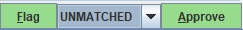

# TUTORIEL USAGI

En cours de développement...
## Téléchargement du vocabulaire sur Athena 
* Créer un compte sur le site Athena : 

[https://athena.ohdsi.org/auth/register](https://athena.ohdsi.org/auth/register)
* Dans la section Download (menu vert) : se loguer et sélectionner les vocabulaires de destination à télécharger. Ex : Loinc, Specimen type, Snomed, etc.

* Cliquer sur Download vocabularies

* Nommer le fichier et s'assurer que la version du CDM est 5.x
* Sélectionner ou non la case de notification pour être informé par email de mises à jour des vocabulaires sélectionnés puis cliquer sur Download.

* Un lien pour télécharger le fichier *.zip contenant le vocabulaire vous est envoyé par email
* Copier et dé-zipper ce fichier sous le chemin de votre choix. Ex : C:\Athena

## Installation de Usagi
* Pré requis : java 1.8 ou plus
* Dans la section Assets de la page [https://github.com/OHDSI/Usagi/releases](https://github.com/OHDSI/Usagi/releases)

* Télécharger Usagi_v*.jar et copier ce fichier sous le chemin de votre choix dans un répertoire que vous devez créer, nommé Usagi. Exemple de chemin : C:\Usagi
* Entrer votre nom et cliquer sur remember me

## Import du vocabulaire sur USAGI
* Cliquer sur Help >> Rebuild index

* Cliquer sur Pick folder et sélectionner le chemin vers les vocabulaires importés 

*	Utiliser la flèche pour remonter dans l’arborescence
*	Cliquer sur Select folder puis sur Build index

La construction de l’index prend plusieurs minutes…

* Une fois l’index construit, relancer Usagi.

## Préparation des données à mapper
Le fichier importé doit comporter au moins les colonnes contenant le code source et une description du code source en anglais, mais des informations supplémentaires sur les codes peuvent également être importées (par exemple, l'unité de dose, la description en français, la fréquence des codes). 
* Dans un fichier Excel, organiser les données de la façon suivante :
  + Une colonne pour les codes 
  + Une colonne pour les libellés en français que l’on cherche à mapper
  + Une colonne pour la traduction de ces libellés (utiliser deepl ou google translate)
  + Une colonne pour les fréquences

Exemple de fichier Excel pour l'import :

## Importer le fichier sous USAGI

* Depuis le menu File, cliquer sur import codes

* Ouvrir le fichier Excel qui contient les données 

*	Dans la section Column mapping (en bas à gauche), faire correspondre les colonnes du fichier Excel avec celles attendues : 
    +	source name column => libellé source en anglais
    +	source frequency column => nb de fois que ce libellé est observé dans la table
    +	Additional info column => libellé en français
    +	Laisser "Filter standard concepts" et "Include source domain" actifs
    +	Option 1 : Ajouter Filter by domain et choisir le domaine de destination 
      Ex : Specimen, Spec disease status, Spec anatomic site, etc.
    + Option 2 : Ajouter Filter by vocabulary et choisir le vocabulaire de destination
      Ex : Loinc

NB : Si certaines colonnes ne sont pas visibles, utiliser l’ascenseur 

* Cliquer sur import 

Cela prend quelques minutes.

* L’interface obtenue se divise en trois panneaux:
  + Vue de la table

  + Vue des mappings sélectionnés 

  + Vue de la recherche

  - Laisser Filter standard concepts et Include source terms  actifs
   
  - Ajouter filter by domain (filtrer sur le domaine choisi lors de l’import) 

Dans l’exemple ci-dessous si le filtre sur le domaine spec disease status est activé, nous obtenons trois propositions :

  - L’option Query permet une recherche personnalisée
  - Avec l’option Use source term choisi par défaut, USAGI liste des propositions de mapping dans l’encart Results.
  - Sélectionner une des lignes proposées et cliquer sur « add concept» ou « replace concept » pour ajouter ou remplacer un concept dans la vue des mappings sélectionnés. *Il est possible d'avoir plusieurs concepts destinataires pour un même concept source*.
  - Il est possible de mettre un drapeau ou d’approuver directement la proposition de mapping. 
  - L’utilisation des attributs EQUAL, EQUIVALENT, ETC. est optionnelle et ne sert qu’à commenter le fichier de travail (ces attributs n’apparaitront plus dans le fichier final exporté)

* Une fois approuvée ou signalée par un drapeau, *tous les mappings de la vue des mappings sélectionnés* sont associés au code source et la ligne suivante est chargée.

Après signalement par un drapeau, les lignes dans la vue de la table sont écrites en rouge. Après approbation, elles sont surlignées en vert :

* Si aucune proposition ne convient : signaler la ligne par un drapeau => ne pas approuver, ajouter UNMATCHED si besoin (ou autres options utiles pour ce fichier de travail)

NB : Penser à changer l’attribut sur la prochaine ligne 
*	Il est possible de sauver ce document de travail afin d’y revenir plus tard 

## Reprendre un mapping en cours

* Relancer USAGI (fichier jar)
* Cliquer sur File >> Open

* Continuer le mapping : seules les lignes approuvées seront exportées 

NB :  si pour un libellé source, il n’existe pas de correspondance, la ligne est signalée par un drapeau, elle ne sera pas exportée.

## Export des résultats

* Dans le menu File, cliquer sur Export source to concept map

ATTENTION IMPORTANT : choisir "Only approved" pour n’exporter que le mapping approuvé

Export for review

*	Choisir un id pour le vocabulaire :
L’id doit être court et peut comporter des espaces
 ex : 
« Chu Spec » pour le domaine specimen
« Chu Spec Anat » pour le domaine spec anatomic site
« Chu Spec Disease » pour le domaine spec disease status

* Nommer le fichier résultat en précisant le domaine cible :
Ex : MPTL_CHU_SPEC_DISEASE pour le domaine spec disease status

-------------------------- SECTION EN COURS DE DEV--------------------------
##	Mise à jour du vocabulaire
1.	Télécharger les nouveaux fichiers de vocabulaire depuis Athena
2.	Reconstruiser l'index Usagi (Aide -> Reconstruire l'index).
3.	Ouvrer le fichier de mapping
4.	Identifier les codes qui correspondent à des concepts qui, dans la nouvelle version du vocabulaire, ne sont plus des concepts standard, et trouver des concepts cibles plus appropriés.

